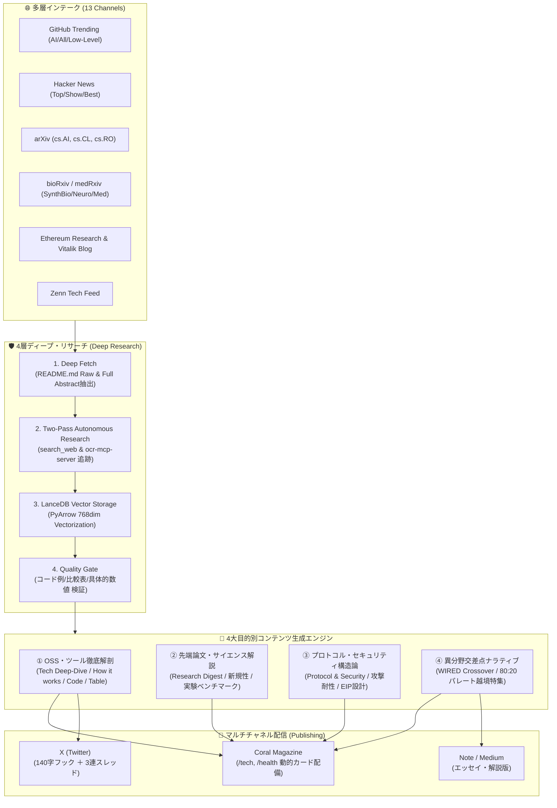

# Multi-Purpose Deep Content Engine Architecture

```mermaid
flowchart TB
    subgraph Sources ["🌐 多層インテーク (13 Channels)"]
        S1["GitHub Trending (AI/All/Low-Level)"]
        S2["Hacker News (Top/Show/Best)"]
        S3["arXiv (cs.AI, cs.CL, cs.RO)"]
        S4["bioRxiv / medRxiv (SynthBio/Neuro/Med)"]
        S5["Ethereum Research & Vitalik Blog"]
        S6["Zenn Tech Feed"]
    end

    subgraph DeepIntake ["🛡️ 4層ディープ・リサーチ (Deep Research)"]
        D1["1. Deep Fetch<br/>(README.md Raw & Full Abstract抽出)"]
        D2["2. Two-Pass Autonomous Research<br/>(search_web & ocr-mcp-server 追跡)"]
        D3["3. LanceDB Vector Storage<br/>(PyArrow 768dim Vectorization)"]
        D4["4. Quality Gate<br/>(コード例/比較表/具体的数値 検証)"]
    end

    subgraph ContentEngine ["🎯 4大目的別コンテンツ生成エンジン"]
        G1["① OSS・ツール徹底解剖<br/>(Tech Deep-Dive / How it works / Code / Table)"]
        G2["② 先端論文・サイエンス解説<br/>(Research Digest / 新規性 / 実験ベンチマーク)"]
        G3["③ プロトコル・セキュリティ構造論<br/>(Protocol & Security / 攻撃耐性 / EIP設計)"]
        G4["④ 異分野交差点ナラティブ<br/>(WIRED Crossover / 80:20 パレート越境特集)"]
    end

    subgraph Distribution ["🚀 マルチチャネル配信 (Publishing)"]
        P1["Coral Magazine<br/>(/tech, /health 動的カード配備)"]
        P2["X (Twitter)<br/>(140字フック ＋ 3連スレッド)"]
        P3["Note / Medium<br/>(エッセイ・解説版)"]
    end

    Sources --> D1
    D1 --> D2
    D2 --> D3
    D3 --> D4
    D4 --> ContentEngine
    G1 --> P1
    G2 --> P1
    G3 --> P1
    G4 --> P1
    G1 --> P2
    G4 --> P3
```
