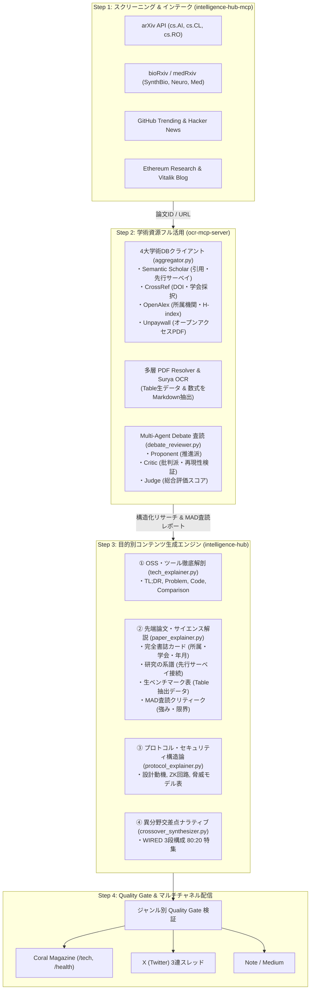

# Multi-Purpose Deep Content Engine Architecture (Tri-MCP Integration)

```mermaid
flowchart TB
    subgraph Step1 ["Step 1: スクリーニング & インテーク (intelligence-hub-mcp)"]
        S1["arXiv API (cs.AI, cs.CL, cs.RO)"]
        S2["bioRxiv / medRxiv (SynthBio, Neuro, Med)"]
        S3["GitHub Trending & Hacker News"]
        S4["Ethereum Research & Vitalik Blog"]
    end

    subgraph Step2 ["Step 2: 学術資源フル活用 (ocr-mcp-server)"]
        O1["4大学術DBクライアント (aggregator.py)<br/>・Semantic Scholar (引用・先行サーベイ)<br/>・CrossRef (DOI・学会採択)<br/>・OpenAlex (所属機関・H-index)<br/>・Unpaywall (オープンアクセスPDF)"]
        O2["多層 PDF Resolver & Surya OCR<br/>(Table生データ & 数式をMarkdown抽出)"]
        O3["Multi-Agent Debate 査読 (debate_reviewer.py)<br/>・Proponent (推進派)<br/>・Critic (批判派・再現性検証)<br/>・Judge (総合評価スコア)"]
    end

    subgraph Step3 ["Step 3: 目的別コンテンツ生成エンジン (intelligence-hub)"]
        G1["① OSS・ツール徹底解剖 (tech_explainer.py)<br/>・TL;DR, Problem, Code, Comparison"]
        G2["② 先端論文・サイエンス解説 (paper_explainer.py)<br/>・完全書誌カード (所属・学会・年月)<br/>・研究の系譜 (先行サーベイ接続)<br/>・生ベンチマーク表 (Table抽出データ)<br/>・MAD査読クリティーク (強み・限界)"]
        G3["③ プロトコル・セキュリティ構造論 (protocol_explainer.py)<br/>・設計動機, ZK回路, 脅威モデル表"]
        G4["④ 異分野交差点ナラティブ (crossover_synthesizer.py)<br/>・WIRED 3段構成 80:20 特集"]
    end

    subgraph Step4 ["Step 4: Quality Gate & マルチチャネル配信"]
        QG["ジャンル別 Quality Gate 検証"]
        P1["Coral Magazine (/tech, /health)"]
        P2["X (Twitter) 3連スレッド"]
        P3["Note / Medium"]
    end

    Step1 -->|論文ID / URL| Step2
    Step2 -->|構造化リサーチ & MAD査読レポート| Step3
    Step3 --> QG --> P1 & P2 & P3
```
